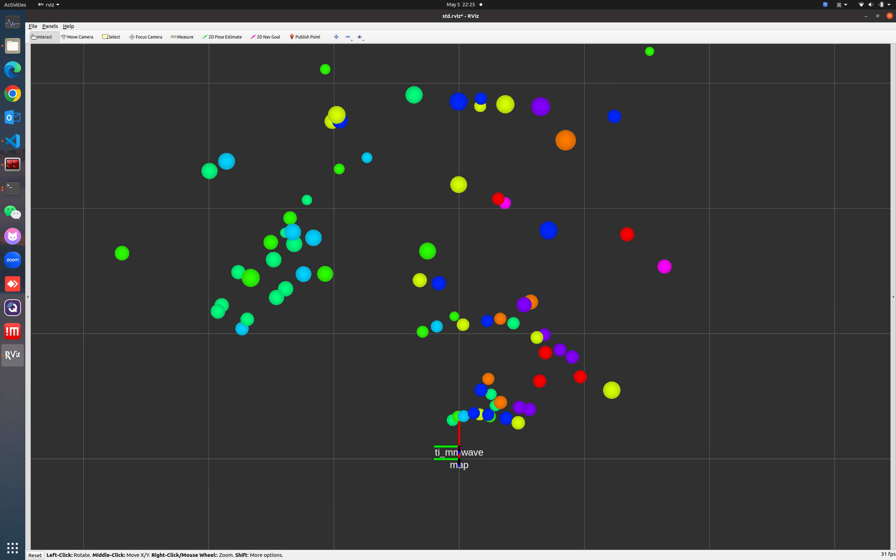

# TI mmwave ros driver

## Manual
[IWR6843AOP](https://www.ti.com/lit/ug/swru546e/swru546e.pdf)

## Flash .bin to hardware


## Compile and Run
```shell
catkin build
```

```shell
sudo chmod 666 /dev/ttyUSB0
sudo chmod 666 /dev/ttyUSB1
source devel/setup.bash
roslaunch ti_mmwave_rospkg ti_radar.launch
```

## Visualization



