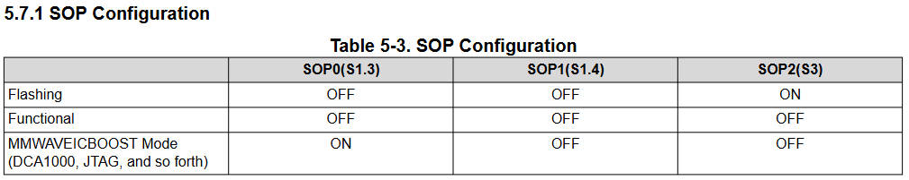
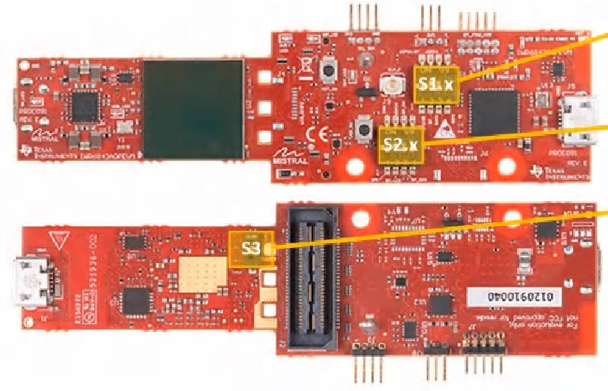
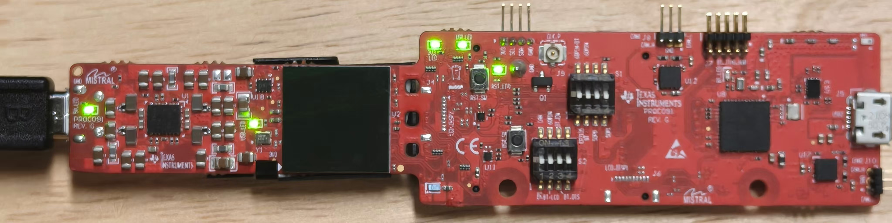

# TI mmwave ros driver

The code has been tested on **Ubuntu 20.04 with ROS Noetic**

## Manual
[IWR6843AOP](https://www.ti.com/lit/ug/swru546e/swru546e.pdf)

## Flash .bin to hardware
[Download UniFlash](https://www.ti.com.cn/tool/cn/UNIFLASH)




[Visualization Tool](https://dev.ti.com/gallery/view/mmwave/mmWave_Demo_Visualizer/ver/3.6.0/)

## Compile and Run
```shell
cd $MMWAVE_WS/src
catkin build
```

```shell
sudo chmod 666 /dev/ttyUSB0
sudo chmod 666 /dev/ttyUSB1
source devel/setup.bash
roslaunch ti_mmwave_rospkg ti_radar.launch
```

While in right status, the light would be as follow.



## Visualization


